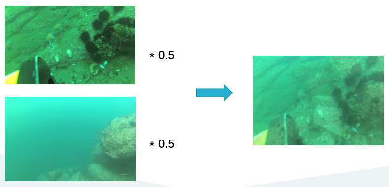

# underwater-object-detection-mmdetection

## [和鲸社区Kesci 水下目标检测算法赛（光学图像赛项）](https://www.kesci.com/home/competition/5e535a612537a0002ca864ac)

## 答辩PPT
    coming soon or by contacting with me
 
## 整体思路
1. 使用两阶段检测框架，保证精度要求；
2. 使用FPN，增强小目标的检测效果；
3. 使用Mixup、旋转等无损的数据增强技术，减轻网络过拟合，并提升模型泛化能力；
    
    
    
4. 使用多尺度训练与预测，适应图片分辨率差异，可以让参与训练的目标大小分布更加均衡，使模型对目标大小具有一定的鲁棒性；
5. 参考ResNet论文，使用[Global Context ROI](https://arxiv.org/abs/1512.03385)为每个候选框添加上下文信息，充分利用数据分布特点，提升了检测精度。

## 消融实验
<table>
    <tr>
        <th>Backbone</th>
        <th>DCN</th>
        <th>MS</th>
        <th><a href="https://github.com/sankin97/Underwater_detection/blob/master/mmdet/datasets/pipelines/transforms.py">Mixup</a></th>
        <th>RandomRotate90°</th>
        <th><a href="https://github.com/cizhenshi/TianchiGuangdong2019_2th/blob/master/src/mmdet/models/roi_extractors/single_level.py">GC</a></th>
        <th>mAP</th>
    </tr>
    <tr>
        <th>ResNet50-FPN</th>
        <th></th>
        <th></th>
        <th></th>
        <th></th>
        <th></th>
        <th>baseline</th>
    </tr>
    <tr>
        <th>ResNeXt101-FPN</th>
        <th>&#10003;</th>
        <th>&#10003;</th>
        <th></th>
        <th></th>
        <th></th>
        <th>baseline+3.35%</th>
    </tr>
    <tr>
        <th>ResNeXt101-FPN</th>
        <th>&#10003;</th>
        <th>&#10003;</th>
        <th>&#10003;</th>
        <th></th>
        <th></th>
        <th>baseline+4.25%</th>
    </tr>  
    <tr>
        <th>ResNeXt101-FPN</th>
        <th>&#10003;</th>
        <th>&#10003;</th>
        <th></th>
        <th></th>
        <th>&#10003;</th>
        <th>baseline+4.36%</th>
    </tr>
    <tr>
        <th>ResNeXt101-FPN</th>
        <th>&#10003;</th>
        <th>&#10003;</th>
        <th></th>
        <th>&#10003;</th>
        <th>&#10003;</th>
        <th>baseline+4.69%</th>
    </tr>   
</table>

## 项目运行的资源环境
+ 操作系统：Ubuntu 18.04.2
+ GPU：2080Ti * 4
+ Python：Python 3.6.8
+ NVIDIA依赖：
    - CUDA：V10.0.130
    - CUDNN：7.4.1
    - NVIDIA驱动版本：410.73
+ 深度学习框架：PyTorch1.1.0

## 环境安装及编译
1. conda create -n 自拟环境名称 python=3.7 -y
2. conda install pytorch=1.1.0 torchvision=0.3.0 cudatoolkit=10.0
3. pip install cython && pip install -r requirements.txt
4. conda install pillow=6.1
5. pip install tqdm
6. pip install pytest-runner -i http://pypi.douban.com/simple/ --trusted-host pypi.douban.com
7. python setup.py develop

## 预训练模型下载
 - 下载mmdetection官方开源的htc的[resnext 64×4d 预训练模型](https://s3.ap-northeast-2.amazonaws.com/open-mmlab/mmdetection/models/htc/htc_dconv_c3-c5_mstrain_400_1400_x101_64x4d_fpn_20e_20190408-0e50669c.pth)
 - 百度网盘下载地址：链接:https://pan.baidu.com/s/1r3uQVpOLKfjF8vfLEYPMgg  密码:811m

## 模型训练与预测
  - **训练**

	1. 运行：
          
        x101_64x4d (htc pretrained):
        
		chmod +x tools/dist_train.sh

        ./tools/dist_train.sh configs/underwater/cas_x101/cascade_rcnn_x101_64x4d_fpn_dcn_1x.py 4
        
        (上面的4是我的gpu数量，请自行修改)

   	2. 训练过程文件及最终权重文件均保存在config文件中指定的work_dirs目录中

  - **预测**

    1. 运行:
    
        x101_64x4d (htc pretrained):

        chmod +x tools/dist_test.sh

        ./tools/dist_test.sh configs/underwater/cas_x101/cascade_rcnn_x101_64x4d_fpn_dcn_1x.py work_dirs/cas_x101_64x4d_fpn_htc_dconv_1x/latest.pth 4 --json_out results/cas_x101.json
        
        (上面的4是我的gpu数量，请自行修改)

    2. 预测结果文件会保存在 /results 目录下

    3. 转化mmd预测结果为提交csv格式文件：
       
       python tools/post_process/json2submit.py --test_json cas_x101.bbox.json --submit_file cas_x101.csv

       最终符合官方要求格式的提交文件 cas_x101.csv 位于 submit目录下
    
    
## Reference
   - [BaselineBy郑烨](https://github.com/zhengye1995/underwater-object-detection)
   - [2019广东工业智造创新大赛【赛场一】布匹疵点智能识别rank2解决方案](https://github.com/cizhenshi/TianchiGuangdong2019_2th)
   
   
## Contact
    
    author: hk
    qq：3025531252
    email: 3025531252@qq.com
